<div align="center">

# Supplier

**The easy way to find a quote — a B2B printing & design marketplace for the UAE.**

[](https://flutter.dev)
[](https://dart.dev)
[-6C3FC5)](https://bloclibrary.dev)
[](https://firebase.google.com)
[](https://supabase.com)
[](https://pub.dev/packages/get_it)
[](https://sentry.io)
[-F39C12)](#features)
[](#getting-started)

</div>

---

## ✨ Overview

**Supplier** is a large‑scale B2B marketplace that connects **printing houses, packaging manufacturers, signage makers, uniform suppliers and design agencies** with business clients across the United Arab Emirates — a network of **1,200+ registered suppliers**.

Clients browse a deep, categorised service catalogue, configure exactly what they need through **spec‑driven order builders** (paper weight, lamination, print sides, dimensions, quantity…), submit requests for quotation, and negotiate in **real‑time chat** with suppliers or the platform admin.

One codebase serves **two roles** — a **Client** experience (discover, configure, request quotes, chat) and a **Supplier** experience (receive quotation requests, publish offers, respond, get notified) — resolved at login. The app is fully bilingual (**English / Arabic with RTL**), restores its session locally so it opens instantly, and runs on a modern Flutter + Firebase + Supabase stack with crash monitoring via Sentry.

---

## 📱 Screenshots

<div align="center">

### Discovery — category catalogue

| Printing | Paper Products | Bags | Packaging |
|:---:|:---:|:---:|:---:|
| 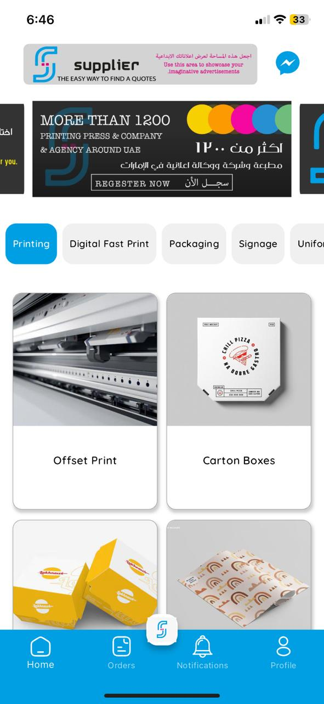 | 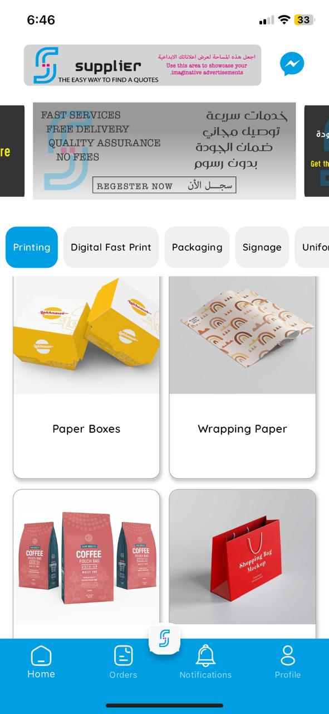 | 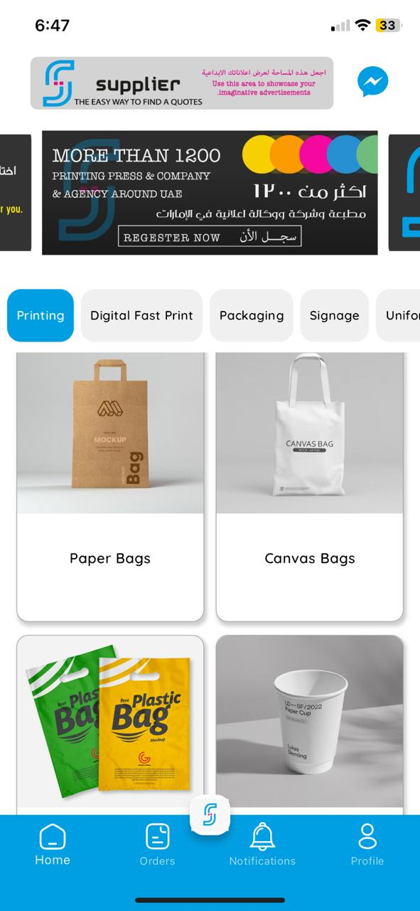 | 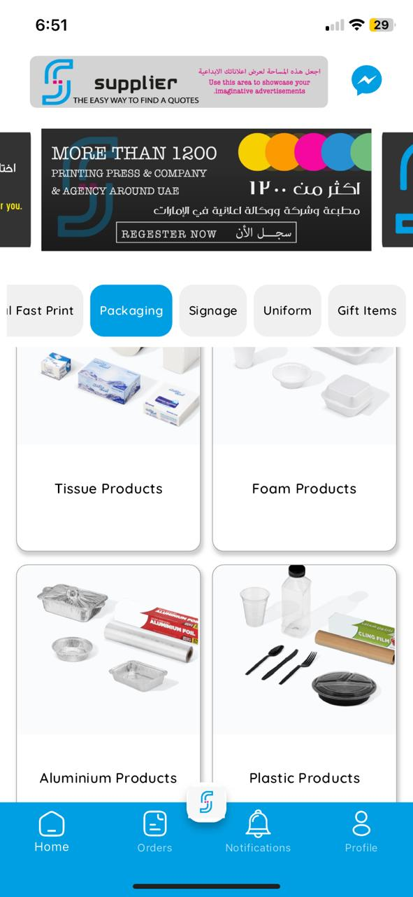 |

### Ordering — spec builders & RFQ

| Hygiene Products | Cleaning Products | Order Configurator | Order Request |
|:---:|:---:|:---:|:---:|
| 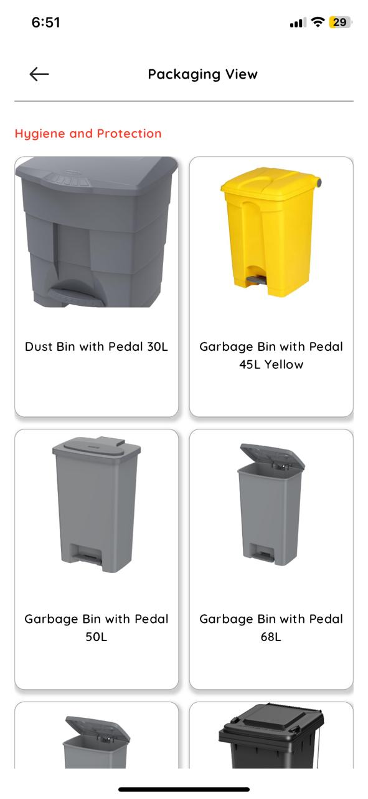 | 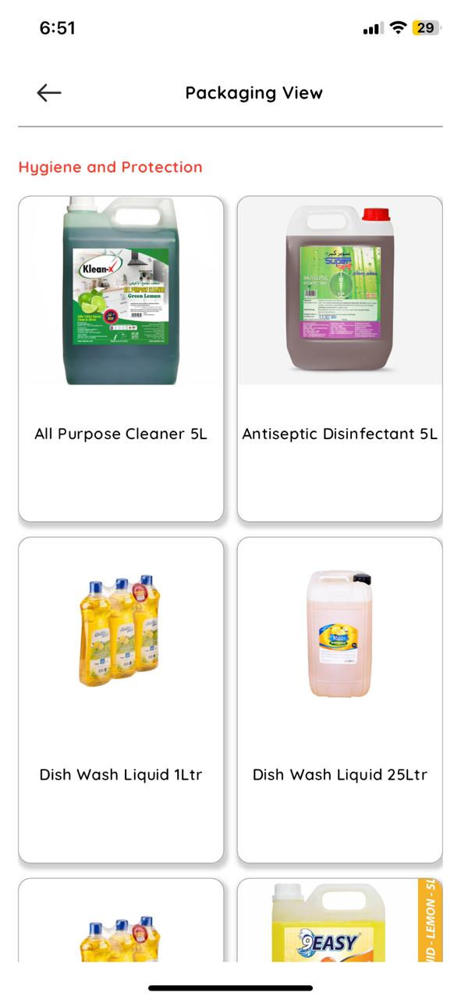 | 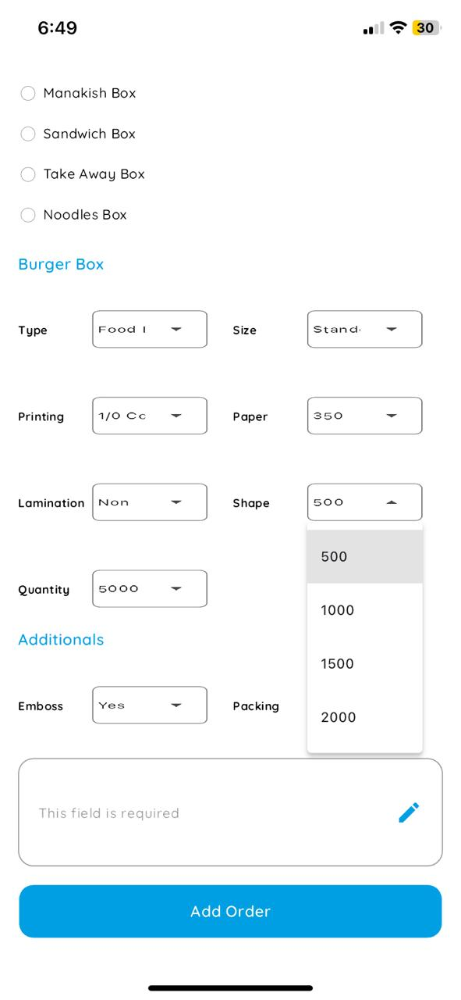 | 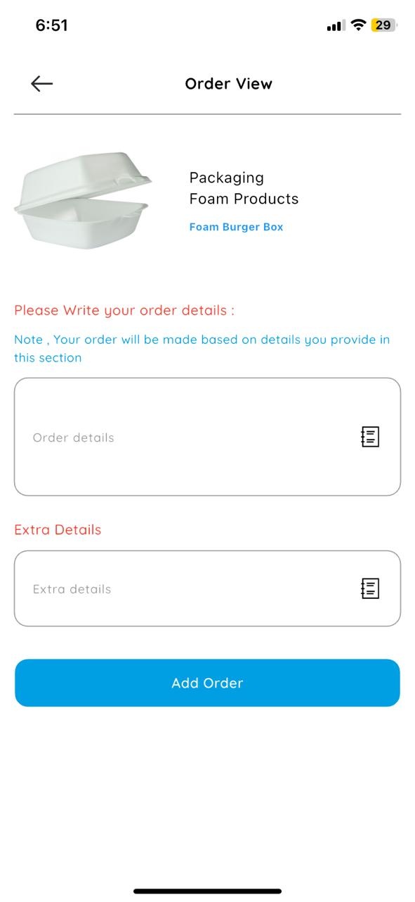 |

### Arabic (RTL) & communication

| Signage (AR) | Uniforms (AR) | Configurator (AR) | Real‑time Chat |
|:---:|:---:|:---:|:---:|
| 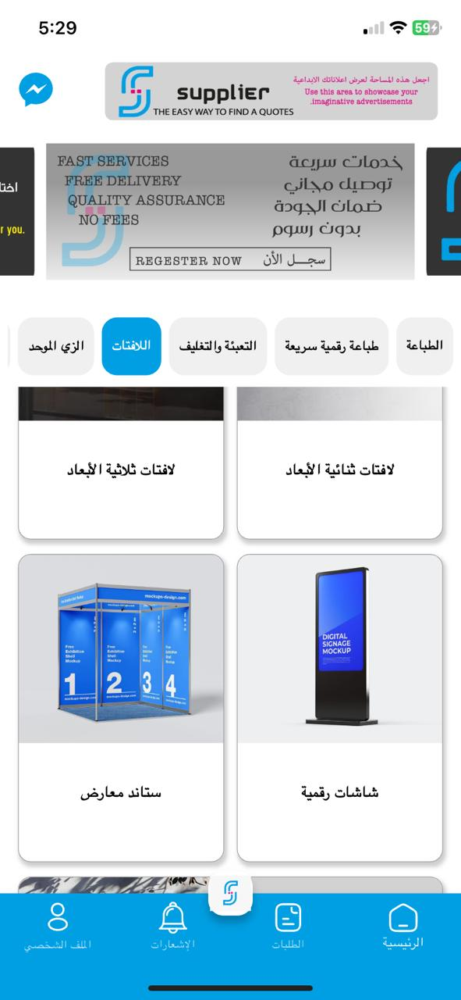 | 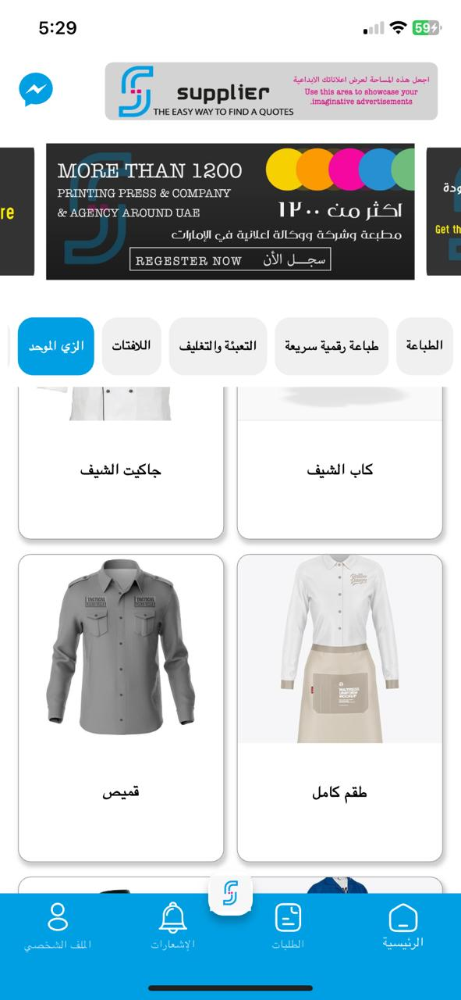 | 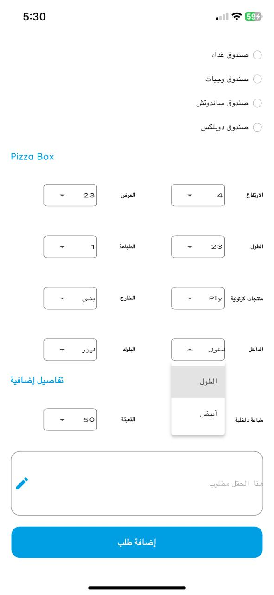 | 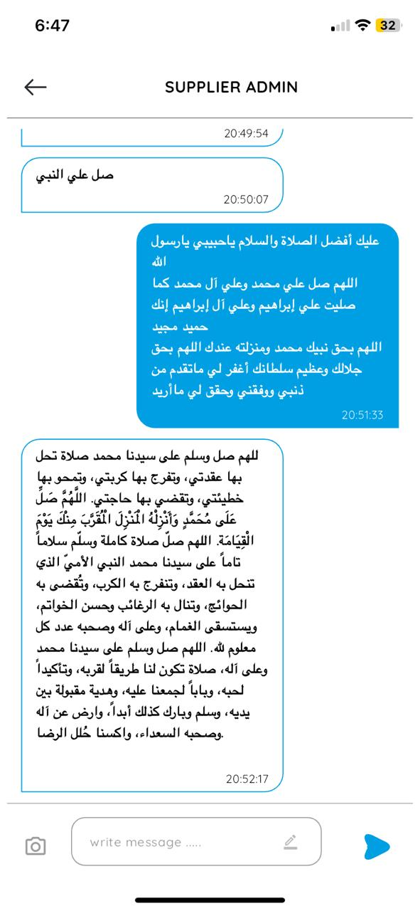 |

### Account

| Edit Profile | Contact Us |
|:---:|:---:|
| 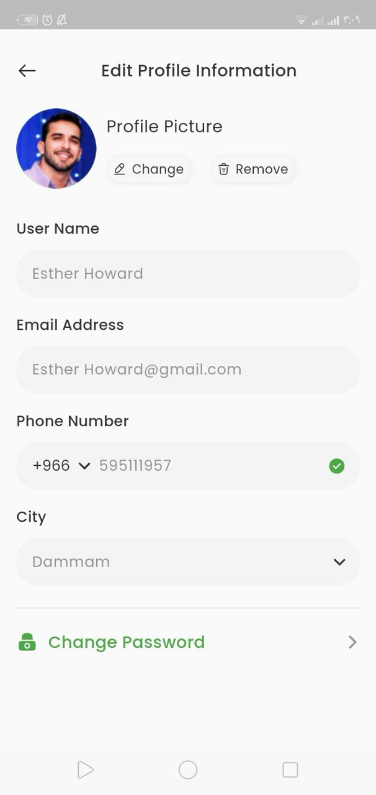 | 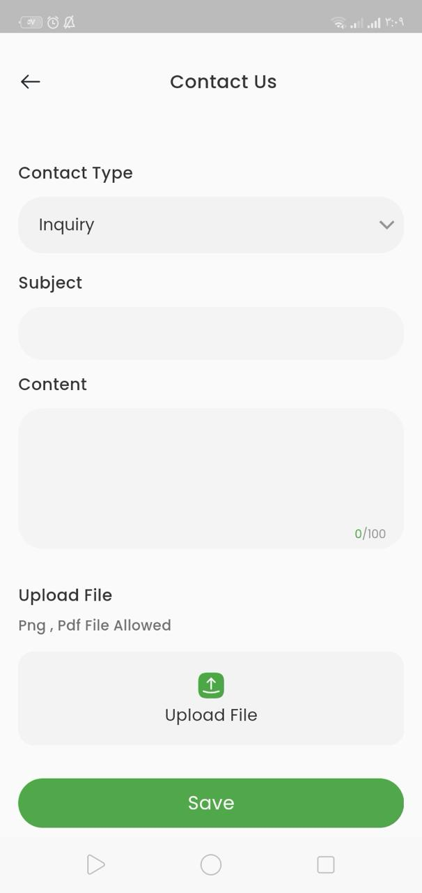 |

</div>

---

## 🚀 Features

| | Feature | Details |
|---|---|---|
| 🗂️ | **Deep service catalogue** | Six top‑level verticals — **Printing, Digital Fast Print, Packaging, Signage, Uniforms, Gift Items** — each with dozens of sub‑categories (offset print, carton boxes, paper bags, foam & aluminium products, 2D/3D signage, exhibition stands, digital screens, chef uniforms…). |
| 🧩 | **Spec‑driven order builders** | Per‑product configurators generate the right form dynamically: type, size, paper weight (gsm), print sides (1/0, 4/4…), lamination, emboss, packing, quantity tiers, height/width/length, ply, inner/outer print — so a quote request is complete on first submission. |
| 📝 | **Request for quotation** | Free‑text order details + extra notes, attached to the selected product, delivered to matching suppliers. |
| 📦 | **Orders & quotations** | Clients track every request in the Orders tab; suppliers get a dedicated home with incoming **quotation requests**, filters, and their own **offers** board. |
| 💬 | **Real‑time chat** | Client ↔ supplier and client ↔ admin messaging with image attachments and timestamps, streamed live from Cloud Firestore. |
| 🔔 | **Push notifications** | Firebase Cloud Messaging through a singleton `NotificationsManager` (permission flow, token registration, background handler) plus an in‑app notification centre. |
| 🔐 | **Authentication** | Firebase Auth with email/password, **Google Sign‑In**, **Sign in with Apple** and OTP phone verification; separate client and supplier onboarding flows. |
| 👤 | **Profiles** | Editable profile with photo (Firebase Storage), phone with country code, city, and password change. |
| 📮 | **Contact & support** | Typed contact form (inquiry, complaint…) with PNG/PDF attachment upload. |
| ⚙️ | **Remote configuration** | Firebase Remote Config for feature flags and banner content; trusted network time via NTP for tamper‑proof time checks. |
| 📄 | **In‑app PDF viewer** | Open quotations and attachments without leaving the app. |
| 🌍 | **Bilingual, RTL‑ready** | Full English / Arabic localisation with `.arb` files; layouts mirror correctly in RTL. |
| ✨ | **Custom animations** | Lottie and hand‑built transitions on top of Material Design; `device_preview` used to validate layouts across screen sizes. |

---

## 🏗️ Architecture

Feature‑first **Clean Architecture** split by **role** (client / supplier), with **Cubit** for state management, `get_it` for dependency injection, and a global `BlocObserver` for tracing state transitions.

```
┌────────────────────────────────────────────────────────────────┐
│  Presentation      Screens · Widgets · Lottie & custom anims   │
│                    BlocBuilder / BlocListener                  │
├────────────────────────────────────────────────────────────────┤
│  Logic             Cubits + immutable States (per feature)     │
│                    AppConfigCubit (session · role · locale)    │
├────────────────────────────────────────────────────────────────┤
│  Data              Models · Repositories (registered in get_it)│
├──────────────────────────────┬─────────────────────────────────┤
│  Remote                      │  Local                          │
│  • Firebase Auth             │  • SharedPreferences            │
│    (email · Google · Apple)  │    (session, role, locale,      │
│  • Cloud Firestore           │     onboarding)                 │
│    (chat, notifications)     │  • .env via flutter_dotenv      │
│  • Supabase Postgres         │    (Supabase key — git‑ignored) │
│    (catalogue, orders,       │                                 │
│     quotations, offers)      │                                 │
│  • Firebase Storage · FCM    │                                 │
│  • Remote Config · Sentry    │                                 │
└──────────────────────────────┴─────────────────────────────────┘
```

```
lib/
├── main.dart                    # dotenv → Supabase → Firebase → FCM → session restore
├── app.dart                     # Root widget: localisation, theme, router
├── firebase_options.dart
├── core/
│   ├── bloc_observer/           # Global Cubit transition logging
│   ├── cubit/                   # AppConfigCubit · NavBarCubit
│   ├── routes/                  # Centralised AppRouter
│   └── utils/
│       ├── constants/           # App, storage & style constants
│       ├── storage/             # SharedPreferencesManager
│       ├── native/              # Image picker
│       ├── notification_service.dart   # FCM NotificationsManager (singleton)
│       ├── service_locator.dart        # get_it registrations
│       ├── configurations.dart · regex.dart · url_launcher_handler.dart
│       └── models/ · styles/ · widgets/
├── l10n/                        # intl_en.arb · intl_ar.arb
└── features/
    ├── onboarding&splash/
    ├── client/
    │   ├── Authentication/      # Sign‑in / sign‑up / OTP
    │   ├── home/                # Banners, categories, packaging & product views
    │   ├── orders/              # Order configurators & history
    │   ├── chat/                # Real‑time conversations
    │   └── settings/            # Profile, contact us, language
    └── supplier/
        ├── Authentication/
        ├── home/                # Quotation requests · offers · filters
        ├── chatSupplier/
        ├── notifications/       # In‑app notification centre
        └── settings/
```

### Key design decisions

- **Role‑based feature modules** — client and supplier flows are isolated under `features/client` and `features/supplier`, sharing only `core/`; the role is resolved once at launch by `AppConfigCubit` and drives routing.
- **Secrets never in source** — the Supabase key loads from a git‑ignored `.env` through `flutter_dotenv`; Firebase config comes from the generated `firebase_options.dart`.
- **Realtime by default** — chat and notifications subscribe to Firestore streams; catalogue, orders, quotations and offers live in Supabase Postgres.
- **Instant launch** — session, role, locale and onboarding state are read synchronously from `SharedPreferences` before the first frame, so returning users land straight on their home.
- **Observability** — `sentry_flutter` captures crashes and performance; a custom `BlocObserver` logs every state change in debug builds.
- **Trusted time** — `ntp` fetches network time so time‑sensitive logic can't be bypassed by changing the device clock.

---

## 🛠️ Tech Stack

| Layer | Technology |
|---|---|
| Framework | Flutter 3.x · Dart 3 |
| State management | [`flutter_bloc`](https://pub.dev/packages/flutter_bloc) (Cubit) + custom `BlocObserver` |
| Dependency injection | [`get_it`](https://pub.dev/packages/get_it) |
| Auth | Firebase Authentication · [`google_sign_in`](https://pub.dev/packages/google_sign_in) · [`sign_in_with_apple`](https://pub.dev/packages/sign_in_with_apple) · [`phone_form_field`](https://pub.dev/packages/phone_form_field) |
| Database | [`supabase_flutter`](https://pub.dev/packages/supabase_flutter) (Postgres) · [`cloud_firestore`](https://pub.dev/packages/cloud_firestore) |
| Push & config | [`firebase_messaging`](https://pub.dev/packages/firebase_messaging) · [`firebase_remote_config`](https://pub.dev/packages/firebase_remote_config) · [`firebase_storage`](https://pub.dev/packages/firebase_storage) |
| Monitoring | [`sentry_flutter`](https://pub.dev/packages/sentry_flutter) |
| Local storage & config | [`shared_preferences`](https://pub.dev/packages/shared_preferences) · [`flutter_dotenv`](https://pub.dev/packages/flutter_dotenv) |
| Localisation | `flutter_localizations` · `intl` (`.arb` — EN / AR) |
| UI | Material · [`flutter_screenutil`](https://pub.dev/packages/flutter_screenutil) · [`flutter_svg`](https://pub.dev/packages/flutter_svg) · [`lottie`](https://pub.dev/packages/lottie) · [`carousel_slider`](https://pub.dev/packages/carousel_slider) · [`shimmer`](https://pub.dev/packages/shimmer) · [`smooth_page_indicator`](https://pub.dev/packages/smooth_page_indicator) · [`flutter_native_splash`](https://pub.dev/packages/flutter_native_splash) |
| Media & docs | [`image_picker`](https://pub.dev/packages/image_picker) · [`flutter_pdfview`](https://pub.dev/packages/flutter_pdfview) |
| Utilities | [`ntp`](https://pub.dev/packages/ntp) · [`package_info_plus`](https://pub.dev/packages/package_info_plus) · [`url_launcher`](https://pub.dev/packages/url_launcher) · [`device_preview`](https://pub.dev/packages/device_preview) |

---

## 🏁 Getting Started

### Prerequisites

- Flutter SDK ≥ 3.19
- A Firebase project (Auth, Firestore, Cloud Messaging, Storage, Remote Config enabled)
- A Supabase project (anon key)

### Setup

```bash
# 1. Clone
git clone https://github.com/MuAshraf811/supplier_uae.git
cd supplier_uae

# 2. Install dependencies
flutter pub get

# 3. Firebase — generate config for your own project
flutterfire configure        # writes lib/firebase_options.dart + platform files

# 4. Supabase — create supa_keys.env in the project root (git‑ignored)
echo 'SUPA_BASE_KEY=your-anon-key' > supa_keys.env

# 5. Run
flutter run
```

### Build

```bash
flutter build apk --release
flutter build ios --release
```

---

## 📄 License

Distributed under the MIT License. See [`LICENSE`](LICENSE).

---

<div align="center">

**Built by [Muhammed Ashraf](https://github.com/MuAshraf811)**

</div>
